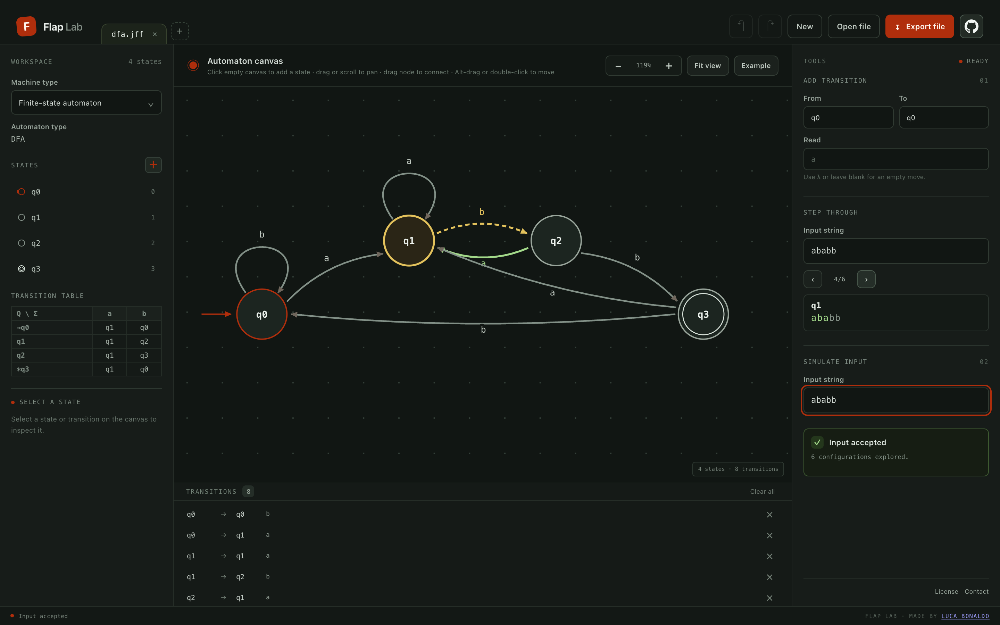
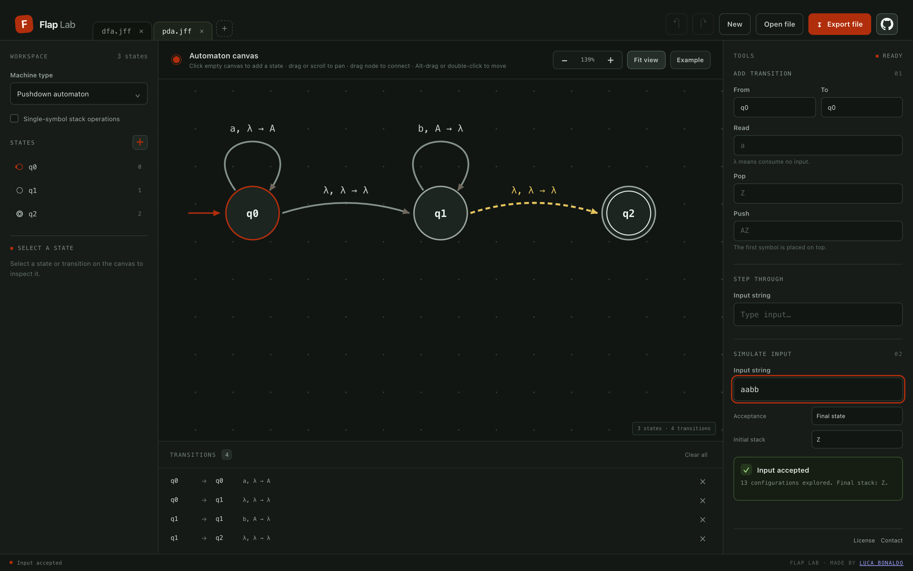

<div align="center">

# Flap Lab

**A browser workbench for automata and formal languages.**

Design and simulate finite-state, pushdown, and Turing machines and transducers, backed by a TypeScript library for grammars, parsing, conversions, and more, entirely client-side.

[](https://flaplab.lucabonaldo.dev)
[](https://www.typescriptlang.org/)
[](https://vite.dev/)
[](#license-and-attribution)

[**Launch the app**](https://flaplab.lucabonaldo.dev) · [Report an issue](https://github.com/LucaBonaldoIT/flaplab/issues) · [Contributing](CONTRIBUTING.md) · [Security](SECURITY.md)

</div>

---

<p align="center">
  
</p>

<p align="center">
  
</p>

## Overview

Flap Lab is a free, static, browser-based JFLAP alternative: a modern reimagining of the classic automata toolkit for students, teachers, and researchers. It pairs a TypeScript computational core with a Vite-powered interface. There is no backend, no account, and no data leaves your machine. Documents are created, edited, and exchanged locally as `.jff` files.

## Features

### Web app

- Finite-state automata (DFA, NFA, λ-NFA), pushdown automata, Turing machines, and Mealy/Moore transducers
- Automatic detection and display of the most restrictive automaton type
- Step-by-step simulation of input strings
- Equivalent DFA generation from NFA/λ-NFA via subset construction
- Multiple documents in tabs, with undo/redo
- Import and export of JFLAP `.jff` files

### Core library (`flaplab-core`)

The library goes beyond what the UI currently exposes.

- **Automata algorithms:** subset construction, DFA minimization, language equivalence, unreachable/useless state cleanup, nondeterminism and λ-closure analysis
- **Grammars and parsing:** regular, context-free, and unrestricted grammars; lambda, unit, and useless production removal; Chomsky normal form; CYK and brute-force parsing; FIRST/FOLLOW sets; LL(1), SLR(1), and LR(1) table generation and parsing
- **Conversions:** regular expression ↔ finite-state automaton, right-linear grammar ↔ finite-state automaton, context-free grammar ↔ pushdown automaton, pushdown automaton → context-free grammar, Turing machine → unrestricted grammar
- **Other tools:** pumping lemmas and L-system expansion
- **Interchange:** JFLAP `.jff` codec; JFLAP 3 text formats are import-only

## Getting started

### Prerequisites

- Node.js 20 or later
- npm 10 or later

### Run locally

```sh
git clone https://github.com/LucaBonaldoIT/flaplab.git
cd flaplab
npm install
npm run webapp:dev
```

Vite prints the local URL, typically `http://localhost:5173`.

### Scripts

| Command | Description |
| --- | --- |
| `npm run webapp:dev` | Start the web app dev server with hot reload |
| `npm run webapp:build` | Build the static site into `apps/webapp/dist/` |
| `npm run webapp:check` | Type-check the web app |
| `npm run build` | Build the core library |
| `npm test` | Build and test the core library |
| `./build.sh` | Install dependencies if needed and produce the static site |

### Deployment

`npm run webapp:build` emits a fully static site in `apps/webapp/dist/`. Serve it from any static host (GitHub Pages, Netlify, Cloudflare Pages, S3, or plain nginx).

## Project structure

```text
flaplab/
├── apps/
│   └── webapp/          Vite + TypeScript browser UI
├── packages/
│   └── core/            flaplab-core: computational library
│       ├── src/         Models, simulators, algorithms, grammars, codecs
│       └── test/        Node test runner suites
├── LICENSE              MIT license (non-JFLAP portions)
├── LICENSE-JFLAP        JFLAP 7.0 license (governs derived portions)
└── build.sh             Static build helper
```

## Using the core library

`flaplab-core` is an ES module package that works in Node and in the browser. It is not yet published to npm; use it from the workspace.

```ts
import {
  regularExpressionToFSA,
  determinize,
  minimize,
  FSASimulator,
} from 'flaplab-core';

// In regular expressions, `+` is union.
const nfa = regularExpressionToFSA('(a+b)*abb');
const dfa = minimize(determinize(nfa));

const simulator = new FSASimulator(dfa);
simulator.simulate('aabb'); // true
simulator.simulate('abab'); // false
```

See [`packages/core`](packages/core) for the full API surface: models, simulators, grammar transformations, parsers, converters, pumping lemmas, L-systems, and the JFLAP codecs.

## Contributing

Contributions are welcome. Please read [CONTRIBUTING.md](CONTRIBUTING.md) for the development workflow and pull request guidelines. To report a vulnerability, see [SECURITY.md](SECURITY.md).

## License and attribution

Flap Lab's core is derived from **JFLAP 7.0**. The JFLAP license (`LICENSE-JFLAP`, also in `packages/core/LICENSE-JFLAP`) governs all JFLAP-derived material. In summary:

- Flap Lab and any product containing JFLAP-derived material must be distributed **without charge**.
- Copies must include the JFLAP license.
- Changes and source must be provided to the JFLAP maintainer without charge on request.
- Susan H. Rodger's name must not be used to endorse or promote Flap Lab without permission.

The MIT license in `LICENSE` applies **only** to portions not covered by the JFLAP license. It does not remove the JFLAP license conditions for the combined project.

The original Lenore-Systems codec was unimplemented in the Java source and is not included. JFLAP 3 text formats are import-only, matching the original codec.

**Maintainer contact:** [Flap Lab GitHub issues](https://github.com/LucaBonaldoIT/flaplab/issues).

## Acknowledgments

Flap Lab builds on [JFLAP](https://www.jflap.org/), created by Susan H. Rodger and her students at Duke University. Thanks to the JFLAP authors for decades of work on formal-language education.

Created and maintained by [Luca Bonaldo](https://lucabonaldo.dev).
